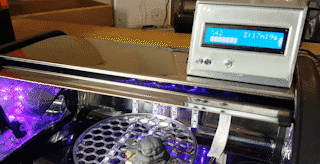

# Cure-O-Matic
This is an arduino based DIY curing station for 3D SLA Resin prints.

The user can set the timer through the LCD Keypad Shield. The station has a rotating turntable and 405nm UV Leds to evenly post-cure the placed model.

## Parts Required
- 1x Arduino Uno
- 1x LCD Keypad Shield
- 2x Irf520
- 1x Lm2596 step-down dc-dc converter
- 1-2 meters UV Led strip - 5050 SMD - 405nm
- 1x 80mm 12V PC Fan
- 100 ohm resistor
- Buzzer
- <a href="https://www.bananarobotics.com/shop/Yellow-Gear-Motor-with-120-to-1-reduction-ratio" target="_blank">3-6V Gear Motor </a>
- 12V 3A power supply
- DC Barrel Jack - Female
- Rocker Switch
- Jumper cables, heat shrinking tube, 3mm screws & nuts, double-sided tape
- A steel bread box

## How To Build
-You will be using the steel bread box as the enclosure (thanks to Sean Charlesworth from Tested for the idea). Bread boxes have the perfect size for SLA prints and the reflective surface of a steel one helps with the curing.

-3d print the files in the stl_files folder.

-Build the circuit based on this diagram. I recommend adding some male headers to the D3,11,12,5V and GND pins below the Arduino Uno, so you can simply connect the rest of the components with jumper wires. 

-You need to disassemble the bread box and stick the LED strips to the case, ensure they are shaped like an arc in order to cure the model efficiently. Cut and solder the led strip based on the size/shape of your bread box. I recommend you to add a slightly wider double-sided tape behind the led strip to avoid any direct contact with the metal (and conductive :) ) box.

-Drill some holes to place the gear motor and the rotating platform in the middle of the box. Drill the screw holes on the top of the box to place the control box. 

-(Optional) if you're adding a fan, drill it's mounting and vent holes to the side of the box.

-Upload the code to the arduino, place the circuit in the control box. Set the DC-DC converter output to 5V using the trimpot on it.

-Connect the motor to one of the Irf520s (the one receiving 5V from the DC-DC converter).

-Connect the led strip and the fan to the Irf520 that is receiving 12V from the power supply.

-Connect the power supply, turn on the rocker switch, place your model in it, select a timer from the LCD screen and start curing!

## Notes
-This was a quick build, there can be many improvements done.

-You can use a stepper motor instead of the gear motor for a much more precise rotation. To do that, you can use stepper controller instead of the 5V Irf520 and slightly modify the code to drive the stepper motor. Of course, you'll need to modify the stl file of the motor coupling as well.

-I used 1m of UV Led strip, you can use more to increase efficiency of the curing process. 

## Some detail pictures to help you with the build

